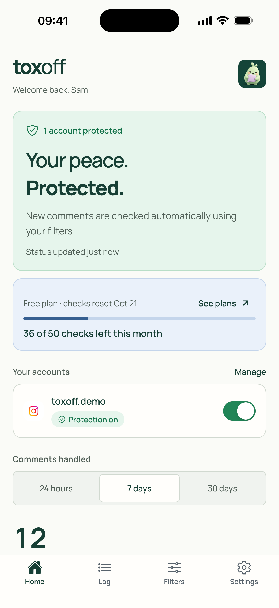
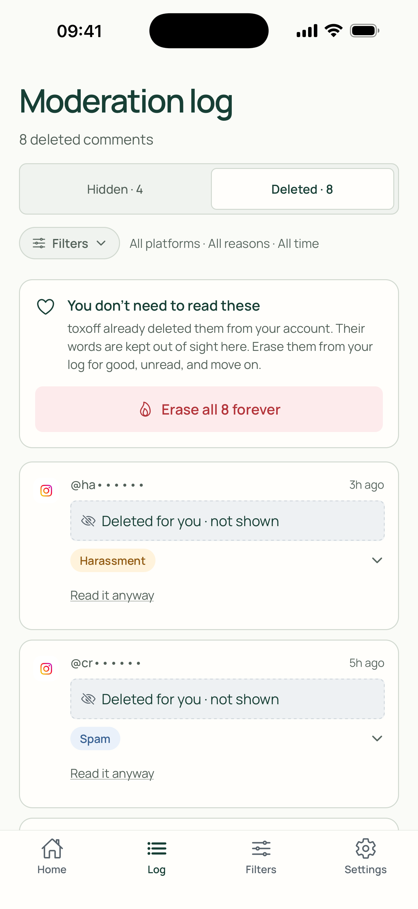
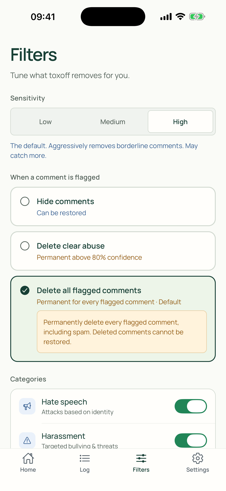
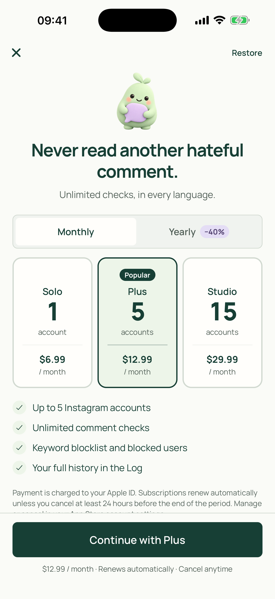
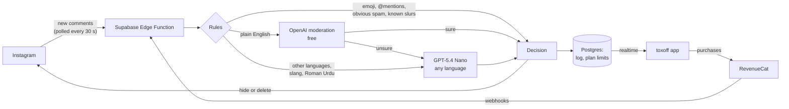

# toxoff

**Keep hate off your comments. Automatically.**

toxoff is an iPhone app for creators. It watches their Instagram comments and removes abusive
ones, usually before the creator ever reads them. It understands the languages South Asian
creators actually get abused in: Roman Urdu, Hindi, Punjabi and mixed English, which
keyword filters and English-only moderation miss.

> Built for **RevenueCat Shipaton 2026** (Next Gen Award). **[▶ Watch the demo video](https://youtube.com/shorts/xzV1aUa7RAY)**: real abuse deleted from a real Instagram account, and a subscription bought through RevenueCat, on an iPhone.

| Home | Deleted, unread | Filters | Paywall |
| --- | --- | --- | --- |
|  |  |  |  |

---

## Why

Instagram lets you hide comments with words from a list. That fails in two ways. Abuse in different languages has no fixed spelling, so word lists alone never keep up. And a filter that only hides still leaves the creator to scroll through the hidden folder, reading every insult to check nothing
good was caught.

toxoff detects and removes curse words and abuse **in any language and any format**: English or
Roman Urdu, Hindi and Arabic scripts, mixed-language comments, creative misspellings and
disguised letters.

toxoff treats the comment section as a mental-health problem, not only a spam problem:

- **It reads the comment the way a person would.** A small language model scores each comment
  for harassment, hate, slurs, threats and sexual abuse, in any language or script.
- **Removed means gone.** New accounts delete flagged comments by default. The Log keeps them
  under **Deleted**, with the words covered ("Read it anyway" if you really want to), and you can
  **erase them forever, unread**.
- **Fast.** Comments on a fresh post are checked about every 30 seconds.

## What it does

- Connect an Instagram Business or Creator account (Instagram API with Instagram Login).
- Every new comment is checked once. Toxic ones are hidden or deleted on Instagram, logged, and
  announced with a push notification that never contains the comment's words.
- **Filters:** sensitivity (Low, Medium, High), categories, a keyword blocklist, blocked users,
  and what to do with a flagged comment: hide all, delete all, or auto (delete what the AI is at
  least 80% sure of, hide the rest).
- **Log:** Hidden (readable, restorable to Instagram) and Deleted (covered, erasable).
- **Plans:** Free, Solo, Plus and Studio, sold as App Store subscriptions through RevenueCat.
- **Invites:** a friend who joins and connects a new Instagram account earns you both extra checks.
- Sign in with email, Google or Apple. Account deletion from inside the app.

## How RevenueCat is used

Subscriptions are the whole business model, so RevenueCat sits at the centre of billing and the
**server** decides what a user may do, never the app.

**Plans.** One App Store subscription group with three levels, each monthly or yearly:

| Plan | Instagram accounts | What you get | Price |
| --- | --- | --- | --- |
| Free | 1 | 50 comment checks a month, 7-day log | free |
| Solo | 1 | unlimited checks, keyword blocklist, full log | $6.99 / month, $49.99 / year |
| Plus | 5 | as Solo, plus blocked users | $12.99 / month, $99.99 / year |
| Studio | 15 | as Plus, for managers and small agencies | $29.99 / month, $249.99 / year |

The group is ordered Studio, Plus, Solo, so Apple treats moving up as an immediate upgrade and
moving down as a change at the next renewal.

**In the app** ([`src/lib/purchases.ts`](src/lib/purchases.ts), [`app/paywall.tsx`](app/paywall.tsx)):
- The RevenueCat SDK (`react-native-purchases`) is configured with the toxoff user id, so every
  purchase belongs to the account, not the phone, and follows the user across devices.
- The paywall loads the current **offering** and shows Apple's price in the user's own currency,
  with a "save N%" badge on yearly plans worked out from the real store prices.
- Restore purchases, and Manage subscription (Apple's own screen for changing plan or cancelling).

**On the server** ([`supabase/functions/api/store.ts`](supabase/functions/api/store.ts)):
- After a purchase or restore, and on every **RevenueCat webhook** (renewal, cancellation, billing
  problem, refund, transfer), the backend re-reads the subscriber from RevenueCat's REST API and
  copies the plan onto the user's profile. The app can't grant itself a plan.
- The database enforces the plan: how many accounts may connect, whether a comment may be checked
  (Free's monthly allowance is spent atomically in `claim_comment()`), and how far back the Log
  reaches (row-level security).
- Cancelled plans stay on until the period ends, and so do plans in Apple's billing grace period.
  Refunded or expired plans drop back to Free.

**Why the Free tier is shaped this way.** Each check costs a fraction of a cent (see below), so
Free can be genuinely useful: 50 checks a month covers a small account, and the invite bonus
grows it. The paid plans are for creators whose comment volume, or number of accounts, has
outgrown it. Yearly plans save 31 to 40%.

**Ads, prepared for later.** A rewarded ad for extra checks and a Home banner are built with Google
AdMob, with every impression and its revenue reported to RevenueCat's ad tracker
(`Purchases.adTracker`). The reward is granted only after Google's signed server-side callback.
Ads are **switched off in version 1** (one build setting, `EXPO_PUBLIC_ADS`) until the AdMob
account is approved.

## How moderation works



- **Cheap answers first.** Comments with nothing to read, obvious spam and a built-in list of
  Roman Urdu, Hindi and Punjabi slurs (with spelling variants) are settled by rules with no API
  call. Plain English goes to OpenAI's free moderation endpoint. Only what's left reaches the
  model, at about $0.05 per 1,000 comments.
- **Rate limited and fail-safe.** Model calls are capped per user and for the whole app. A
  comment over the limit waits for the next run instead of being skipped. If anything fails, the
  free check is given back and the comment is tried again.
- **Polling, for now.** Meta only sends comment webhooks to apps that have passed App Review with
  Business Verification, so the backend reads each account's newest posts itself: every 30
  seconds while a post is under 2 hours old, once a minute otherwise, in one Instagram request per
  read, backing off if Meta says to slow down.

## Tech

- **App:** Expo SDK 52 (React Native 0.76, New Architecture), TypeScript, expo-router.
- **Backend:** Supabase (Postgres with row-level security, Auth, Realtime, pg_cron) and one Edge
  Function in Deno ([`supabase/functions/api`](supabase/functions/api)).
- **Payments:** RevenueCat with Apple in-app purchase.
- **AI:** OpenAI GPT-5.4 Nano, with OpenAI's moderation endpoint as a fallback.
- **Builds:** EAS Build (Xcode 26), distributed through TestFlight.

## Try it

> **For judges: what you can and can't try yourself**
>
> - **You can** run the whole app in the iOS Simulator in demo mode (steps below). Sign up or log
>   in with any email and password and you get a demo account with a sample Instagram account
>   and sample moderated comments: Home, the Log, Filters, Settings and the paywall all work.
>   Purchases are simulated, and nothing is sent anywhere.
> - **You can't** connect a real Instagram account. Until Meta's App Review and Business
>   Verification are done, Meta only lets accounts added as testers on the developer's Meta app
>   connect, and today those are the developer's own two accounts. A clone also contains none of
>   the project's keys, so it can't reach the live backend.
> - **The demo video shows the real thing:** an abusive comment deleted from a real Instagram
>   account within a minute, and a real App Store sandbox purchase going through RevenueCat to the
>   backend, on a TestFlight build on an iPhone.

### 1. Demo mode (no accounts or keys needed)

With no `.env` file, the app runs entirely on sample data: sign up, onboarding, Home, Log,
Filters, Settings and the paywall all work, and nothing touches the network.

You need Node.js 18 or later and, for iOS, a Mac with Xcode and the iOS Simulator.

```bash
git clone https://github.com/MubinaMubina/toxoff-app.git
cd toxoff-app
npm install
npx expo start
```

Press **i** to open the iOS Simulator. Expo installs the right version of Expo Go for this
project (SDK 52) the first time. Press **a** for an Android emulator instead. The Expo Go app
from the App Store on a real iPhone may only support newer SDKs, so use the simulator.

In demo mode, purchases are simulated on the device: choosing a plan on the paywall switches the
app to that plan so you can see what changes.

### 2. The real thing

Real purchases need an App Store build (EAS) with a sandbox tester, and connecting Instagram
needs a Meta app. Until Meta completes App Review, only Instagram accounts added as testers can
connect. Everything needed to set up your own backend, Meta app, App Store Connect and RevenueCat
is in the [developer guide](DEVELOPER_GUIDE.md).

## Tests

```bash
npm run typecheck        # TypeScript, strict
npm run test:ui          # app logic: sign-in callbacks, password recovery, protection status, theme contrast
npm run test:functions   # backend unit tests (needs Deno)
npm run test:db          # database rules against a throwaway local Postgres (needs PostgreSQL binaries, PG_BIN)
```

The database tests cover the plan limits, the monthly allowance and bonus pool, invite abuse
cases and which functions each role may call. The backend tests include the RevenueCat store
sync, AdMob signature checks and a security review's regression tests.

## Status

- The app runs end to end on a real Instagram account, and a TestFlight build is at Apple.
- App Store release comes next, after the subscriptions' store metadata and Apple's review.
- Other creators can connect Instagram once Meta's Business Verification and App Review are done.
- TikTok is shown as coming soon.

## Project layout

```
app/                     screens (expo-router): auth, onboarding, tabs, paywall, invite
src/lib/                 Supabase, backend calls, RevenueCat, ads, notifications
src/context/             auth and moderation state
src/data/                plans, prices, defaults, demo data
supabase/migrations/     schema, row-level security, plan limits, cron jobs
supabase/functions/api/  backend: Instagram, classifier, moderation, polling, billing
scripts/                 tests and asset tools
```

## License

[MIT](LICENSE). The bundled Manrope font is under the SIL Open Font License
([`assets/fonts`](assets/fonts)).
