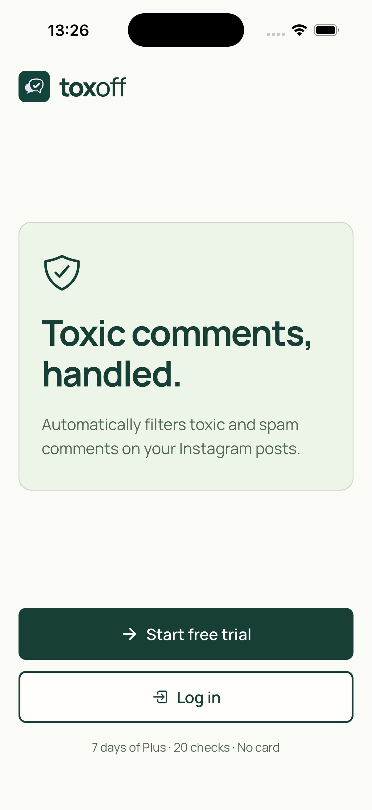
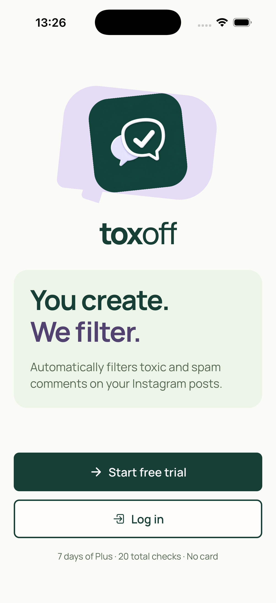

# Welcome screen: gstack iOS design review

**Status: DONE.** The updated welcome screen resolves the weak logo hierarchy and detached layout. The real logo now leads the composition, the copy remains brief, and Log in remains immediately visible at standard text size. Light and dark captures show no critical visual defect. The largest-text captures verify the display-lettering correction and that both complete actions and the full trial note are reachable by scrolling. The scope limits below remain.

Reviewed on 2026-09-15. Scope: screen 01 only, using the local `gstack-ios-design-review` ten-dimension rubric, the supplied iOS simulator PNGs, and `app/splash.tsx`, shared Button, AppText, Logo, and theme source. Final evidence includes dark mode, the `accessibility-extra-extra-extra-large` text category, and login/signup destinations. This is a simulator screenshot and source review, not a physical-device or VoiceOver audit. No app files were changed during this review.

## Before and after

Before: a 34pt logo beside a 28pt wordmark, a separate generic shield, and large gaps around the description rectangle.

After: the actual 136pt logo and 44pt wordmark form one clear brand illustration. The lavender speech-bubble backdrop repeats the mark's own visual language. The sage rectangle contains one short headline and one direct description; the two full-width actions remain below it.

## Rubric

Scores are design judgments on a 0–10 scale, not certification. Unverified dimensions are deliberately not assigned a passing score.

| Dimension | Before | After | Evidence and remaining path to 10 |
| --- | ---: | ---: | --- |
| Typography hierarchy | 8 | 9 | The 40pt headline, 17pt description, and 13pt trial note are distinct. At the largest tested category, the corrected wordmark stays intact and the headline wraps between words. VoiceOver reading order remains unverified. |
| Spacing rhythm | 6 | 9 | Brand and description now form a related group, using 12pt and 24pt spacing with 20pt screen gutters. Both buttons and the footer fit in the reviewed viewport. Confirm the same flow on a shorter iPhone. |
| Color hierarchy | 8 | 9 | Forest identifies the primary action; the strong outlined Log in remains visible. Lavender connects the artwork and headline. The dark capture preserves this hierarchy with light text and mint actions. Color-vision simulation remains unverified. |
| Touch targets | 9 | 9 | Both actions use the shared Button's 56pt minimum height, with a 12pt gap. The implementing agent invoked their actual `onPress` handlers and captured the correct destinations. This checks navigation, not physical touch hit-testing. |
| Loading, empty, and error states | N/A | N/A | This welcome screen has no local asynchronous operation or content-loading state. Authentication screens are outside this review. |
| Accessibility | Unverified | Partial | The decorative artwork is hidden from accessibility traversal, the headline has a header role, and buttons have labels. Largest-category display lettering and scrolled action/footer reachability are visually verified; body and actions retain full native scaling. VoiceOver and color-vision simulation remain unverified. |
| Animation discipline | N/A | N/A | The illustration is static; the rotations do not animate. No welcome-screen motion requires evaluation. |
| iOS convention alignment | 8 | 8 | Safe areas, a native ScrollView, familiar actions, and readable controls are present. Compact-device and accessibility interaction checks would complete the evidence. |
| Information density | 9 | 9 | One brand illustration, one description rectangle, and two actions. Standard-size light and dark captures fit the content. Largest text expands into a vertical scroll layout, with complete action labels and the full three-line trial note visible at the bottom. |
| Distinctiveness / generic-design check | 4 | 9 | The actual comment/check logo replaces the generic shield as the focal point. Its lavender speech-bubble backdrop adds personality without adding instructions or decorative clutter. User feedback remains the appropriate check of the final visual character. |

## Apple guidance and measured checks

Apple's [Branding guidance](https://developer.apple.com/design/human-interface-guidelines/branding) allows branding content on welcome and onboarding screens and supports brand fonts when they remain legible and accessible. A large brand mark here does not imply a change to the system launch screen. The skill's preference for SF Pro is not an Apple requirement to replace the app's existing Manrope font.

Apple's [UI design guidance](https://developer.apple.com/design/tips/) recommends controls at least 44 × 44pt, sufficient contrast, undistorted images, and layouts that fit the device. The source's 56pt minimum buttons exceed that target. Contrast ratios calculated from the light theme's specified colors are 5.48:1 for the description on sage, 7.94:1 for the lavender headline text on sage, 11.67:1 for the primary button label, and 11.58:1 for the Log in label. These are token-based calculations, not a screen-wide accessibility certification.

The source responds to a window height below 780pt or a font scale above 1.2 by reducing the logo to 104pt. Content stays in a ScrollView and the description rectangle has no fixed height. Testing the largest accessibility category exposed unwanted wordmark wrapping. The local fix applies `displayScale = Math.min(fontScale, 2) / fontScale` only to branding and headline sizes, limiting their effective enlargement to 200%; body copy, actions, and the trial note retain full native scaling. The final top capture shows an intact wordmark and headline wrapping between words. This 200% choice is a local design decision, not an Apple-prescribed cap. Apple's [Typography guidance](https://developer.apple.com/design/human-interface-guidelines/typography) calls for checking larger accessibility text sizes in the running app.

## Final verification evidence

- [Dark welcome](01-welcome-dark.png): the logo, description, both actions, and trial note remain visible and readable.
- [Largest text, top](01-welcome-largest-text-top.png): the actual logo reduces in size; branding and headline remain intact after the display-scaling fix.
- [Largest text, actions](01-welcome-largest-text-actions.png): the corrected bottom capture shows the description's final lines, complete Start free trial and Log in buttons, and the full three-line trial note. Its SHA-256 is `e27c91e4884e8ea2b1969bf7a720381bbf07733531772d5ace9a3f4955bcc9fd`, distinct from the top capture. The reviewer visually checked this replacement.
- [Login destination](01-login-navigation-check.png) and [signup destination](01-signup-navigation-check.png): visually confirm the intended screens. The implementing agent reports that NodeQA invoked the actual welcome button `onPress` handlers, with no form submissions or account operations.
- The implementing agent reports that typecheck passed after the final source edit, standard Large text was restored, and the simulator was left on the final light welcome screen.

## Disposition

Keep the approved copy and composition. Dark mode, the largest-text top and scrolled actions, and both navigation destinations now have supporting captures. Smaller-phone scrolling, physical-device behavior, VoiceOver, and color-vision simulation remain outside the evidence here. This review does not request further welcome-screen redesign or guarantee Apple App Review approval.

Durable learnings:

- On this React Native welcome screen, fixed-size marketing lettering needed a 200% effective scaling ceiling to avoid broken wordmark wrapping while body text and actions retained full native scaling. Verify the largest accessibility category and capture both the top and the scrolled actions; a top-only screenshot cannot establish that the controls remain reachable.
- The implementing agent traced the initial duplicate bottom screenshot to a QA scroll helper selecting an older mounted Splash instance. Target the latest mounted screen and verify that the resulting scroll capture differs before treating it as evidence of lower-content reachability.
